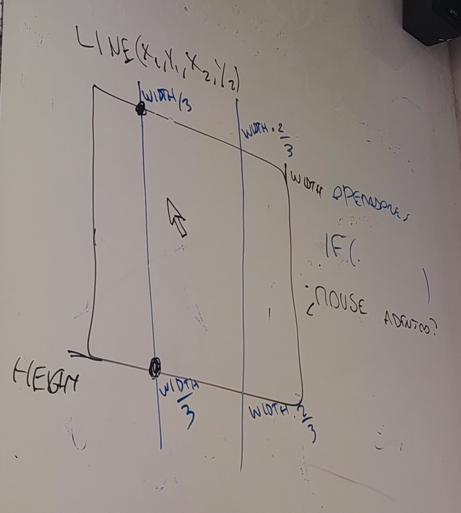
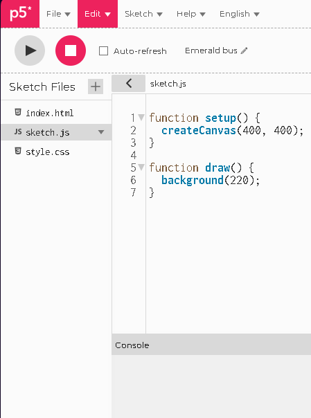

# clase-05

2026-04-24

sketches de hoy:

- <https://editor.p5js.org/matilov/sketches/LMNZN8Tpd>
- <https://editor.p5js.org/matilov/sketches/aSuOidpWw>
- <https://editor.p5js.org/matilov/sketches/iED49vzWF>
- <https://editor.p5js.org/matilov/sketches/V1xB4uMIq>
- <https://editor.p5js.org/matilov/sketches/BjztigT3J>

## repaso clase pasada

vimos cómo crear variables de colores:

fuera del setup debo declarar mi variable:

```js

let verdesitoClaro;
```

dentro del setup debo asignar el color a la variable

```js
function setup(){
verdesitoClaro = color(250,20,20);

}
```

repasamos la función random();

### clase de hoy

vimos como usar lines para crear grillas.

line(posicionXdelPrimerPunto, posicionYdelPrimerPunto, posicionXdelSegundoPunto, posicionXdelSegundoPunto);

```js

line(width/3, 0, width/3, height);

line((width/3)*2, 0, (width/3)*2, height);
```



#### variables

vimos como guardar la posición del mouse en una variable

```js

posMouseX = mouseX;
```

vimos como ocultar el cursor del mouse

```js
noCursor();

```

vimos condiciones. Dividmos el canvas en 3 secciones, y usamos if para que cosas cambien según la posición del mouse.

```js
let colorFondo;
let color1;
let color2;
let color3;

function setup(){
color1=color(200,0,0);
color1=color(0,200,0);
color1=color(0,0,200);
}

function draw(){
posMouseX=mouseX;

if(posMouseX<width/3){
    colorDeFondo = color1;
}
}else if(posMouseX>(width/3)*2){
    colorDeFondo = color2;
}else if(posMouseX<(width/3)*2 && posMouseX > width/3){
    colorDeFondo=color3;
}

```

#### operadores

los operadores nos permiten usar más de una condición a la vez:

##### operador AND

con el operador or, integramos varias condiciones en una, ocurrirá siempre que se gatillen **todas** ellas.

ejemplo transporte público:

necesito tomar micro y metro para llegar a mi casa

|micro|metro|llegarAcasita|
|-|-|-|
|0|0|0|
|1|0|0|
|0|1|0|
|1|1|1|

si tomo solo la micro, no llego.

si tomo solo metro, no llego.

si no tomo ni micro ni metro, no llego

**solo si tomo micro Y metro llego a mi casa**

#### operador OR

con el operador or, integramos varias condiciones en una, ocurrirá siempre que se gatille cualquiera de ellas.

ejemplo transporte público:

puedo llegar a mi casa tomando o metro o micro:

|micro|metro|llegarAcasita|
|-|-|-|
|0|0|0|
|1|0|1|
|0|1|1|
|1|1|1|

si tomo solo la micro, sí llego.

si tomo solo metro, sí llego.

si tomo micro y metro, llego a mi casa

**solo si no tomo ni micro ni metro, no llego**

#### aplicación en código

podemos usar los operadores para combinar condiciones

```js

if(posX>200 || posX<300){
direccion= direccion*-1;
}
```

de esta manera, cada vez que se salga de mi margen(que es entre 200 y 300), el sentido se multiplica -1, osea irá en la dirección contraria a donde iba antes.

### imagenes en p5js

no todas las imágenes son  fotos, pero todas las fotos son imágenes.

a su vez, las imapgenes son archivos. Cuando trabajamos con archivos es importante fijarse, por un lado, en el nombre del archivo, y por otro, la extensión del archivo(jpg, png, mp3, svg, etc)

En el nombre del archivo es importante tener buenos modales(al igual que en la vida en general), y no usar espacios, símbolos, o tildes.

En la sección de la izquierda vemos los archivos del sketch.



para subir imágenes usamos el símbolo "**+**"

dentro del sketch, debemos primero declarar una variable que luego le vayamos a asignar la imagen.

en el setup, usamos loadImage()

```js

function setup(){
    nombreImagen = loadImage("./imagenDescargada.png")
}
// el simbolo de "./" se usa para buscar archivos dentro del mismo lugar donde está tu código.
```

luego, en el setup ponemos nuestra imagen

```js

function draw(){
    image(nombreImagen, width/2, height/2, 100,100);
}
```

la sintaxis de loadImage() es la siguiente:

```js

image(variableDeImagen, posicionX, posicionY, ancho, alto);
```

### subir imágenes a github

cada una de las sesiones de este curso, debe tener su propia carpeta.

Dentro de la carpeta de la clase-05, crea una carpeta imágenes, y dentro de esa carpeta, sube tu png.

## encargo

nos vemos en 2 semanas, son 2 encargos.

### encargo-06

agregar una línea al código de tu solemne-1, que exporte tu sketch en una imgane cuando hagas click

```js

function mousePressed(){

    saveCanvas('solemne1-apellido-nombre', 'png');
}
```

### encargo-07
editar el código de akrila-rebota.

- implementar rebote en el eje vertical.
- que cambie de velocidad aleatoriamente
- que cambie el color de fondo
- con una nueva imagen
- (opcional) poner una imagen de fondo