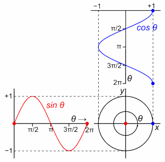

# sesion-06

2026-05-15

## introducción

hablamos del encargo para la solemne-2, se entrega el próximo viernes 22 de mayo

un sketch basado en un **disco** de música chilena.

¿qué es un disco?

dentro de ese contexto, existen singes, EP y LP

llamados en base al tamaño del vinilo que necesitan para caber enteros.

single, es una sola canción.

EP, es un extended play, aprox 4-5 canciones

LP o long play, es un álbum.

El requisito es que en la página donde lo encuentren, diga que es un álbum. **NO un EP**

## pseudocódigo

un pseudocódigo es la decripción simplificada y estructurada.

ejemplo

// un fondo de color verde musgo
// una elipse al medio que sea más ancho que alto
// que la ellipse se mueva lentamente hacia la izquierda
// que la elipse gire 90 grados, de modo que quede más alta que ancha
// el relleno de la elipse debe cambiar de color a un lila

y así pueden programar sin saber de código. Y los resultados que les de la IA será basado en su planificación y no en la base de datos de la IA.

## cátedra

### ciclo for

el ciclo for nos permite repetir una acción una cantidad determinada de veces cambiando una de sus características(posición, color, etc)

por ejemplo, en vez de escribir 100 veces una línea código que coloque una elipse, para tener 5 elipses. Puede generar las 100 elipses con un ciclo for.

la sintaxis es la siguiente:

```javascript

for(qué, cómo va cambiando, cuándo se detiene){
ellipse(posiscion en x, posicion en y, ancho, alto);
}
```

```javascript

for(let i, i++, i<100){
    ellipse(i, 0, 200,200)
}

```

### arrays

un array es un listado que contiene múltiples variables. Cuando en un código tenemos múltiples variables, podemos dejarlas dentro de un array.

La ventaja de usar for loop en conjunto a un array, es que con el for puedes ir cambiando qué elementos del listado estás llamando. Por ejemplo en un arrays de palabras, gracias al for, puedo ir llamando a los distintos elementos a medidas que pasa el tiempo.

```javascript
// defino los elementos dentro de mi array
let personajes=["condorito","papelucho","mampato","tulio","mateo","segurito"];

// por cada "vuelta" al loop, suma 1 a la variable.
for(let i =0; i<10; i= i+1){
    text(personajes[i],width/2, height/2);
}

// al inicio, escribe condorito, a la siguiente vuelta escribe papelucho, a la siguiente vuelta escribe mampato, y así.
```

### relevante

- [ejemplo sin, cos](https://editor.p5js.org/clifford1one/sketches/U8Wjx86Fl)



- [documentación ciclo for](https://p5js.org/reference/p5/for/)

- [documentación arrays](https://p5js.org/reference/p5/Array/)